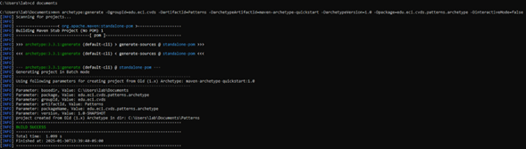
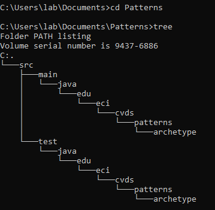
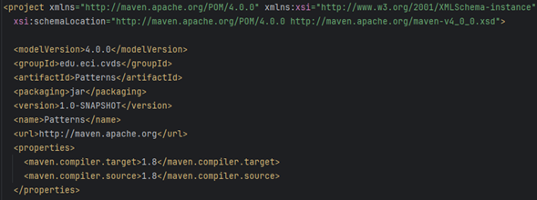
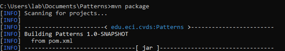
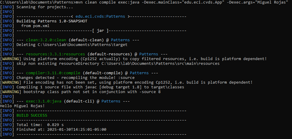
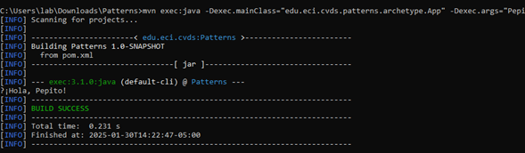
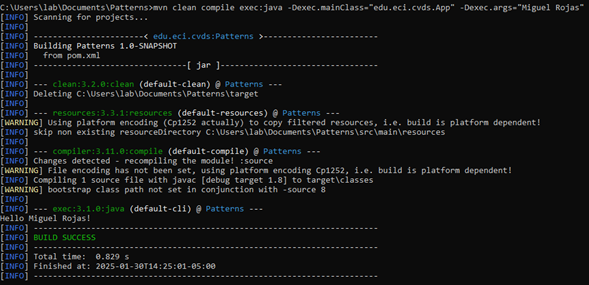
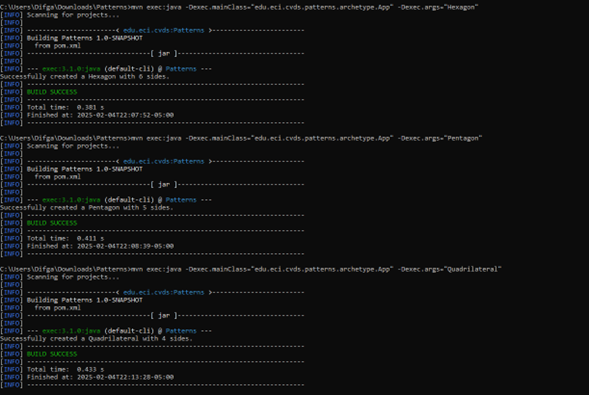
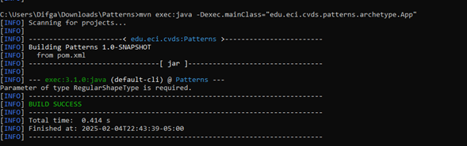

# lab02-CVDS
# integrantes 
    Cristian David Silva Perilla
  
    Juan Miguel Rojas Chaparro 
  
# OBJETIVOS
    Entender ¿qué es Maven?
    
    Maven es una conocida herramienta de código abierto creada para crear, gestionar e implementar simultáneamente varios proyectos para mejorar la gestión de proyectos. Tiene un proceso de desarrollo comparable al de ANT, pero es más innovador que ANT.
    Usar comandos de generación de arquetipos, compilación y ejecución de un proyecto usando Maven
    
    
    Obtener puntos adicionales por PR qué corrijan o mejoren los laboratorios
    LA HERRAMIENTA MAVEN
    Cuál es su mayor utilidad
    Maven es una herramienta de software para la gestión de proyectos Java. Su principal utilidad es simplificar el proceso de construcción, gestión de dependencias y despliegue de proyectos.
    Fases de maven
    El ciclo de vida de Maven se compone de varias fases, cada una con un propósito específico:
    Validate: Verifica que el proyecto es correcto y que toda la información necesaria está disponible.
    Compile: Compila el código fuente del proyecto.
    Test: Prueba el código compilado utilizando frameworks de testing como JUnit.
    Package: Empaqueta el código compilado en un formato distribuible (JAR, WAR, etc.).
    Verify: Realiza comprobaciones adicionales para asegurar la calidad del paquete.
    Install: Instala el paquete en el repositorio local de Maven.
    Deploy: Copia el paquete al repositorio remoto para compartirlo con otros desarrolladores y proyectos.
    
    
    Ciclo de vida de la construcción
    Maven define un ciclo de vida de construcción predeterminado que incluye las fases mencionadas anteriormente. Este ciclo de vida asegura que los proyectos se construyan de manera consistente y predecible.
    Para qué sirven los plugins
    Los plugins de Maven son extensiones que permiten personalizar el proceso de construcción. Se utilizan para realizar tareas específicas durante las diferentes fases del ciclo de vida, como compilar código, generar documentación, ejecutar pruebas, etc
    Qué es y para qué sirve el repositorio central de maven
    El repositorio central de Maven es un repositorio remoto que contiene una gran cantidad de bibliotecas y dependencias de código abierto. Sirve como un punto centralizado para descargar las dependencias necesarias para un proyecto, lo que facilita la gestión y el uso     de bibliotecas externas.
  # Ejercicio de las figuras 

   
    
    Para ver el conjunto de archivos y directorios creados por el comando mvn ejecute el comando tree.
    
  
  
#AJUSTAR ALGUNAS CONFIGURACIONES EN EL PROYECTO
    Edite el archivo pom.xml y realize la siguiente actualización:
    Hay que cambiar la version del compilador de Java a la versión 8, para ello, agregue la sección properties antes de la sección de dependencias:
    
  
      
    COMPILAR Y EJECUTAR
    
  
    
    Verifique cómo enviar los parámetros de forma "compuesta" para que el saludo se realice con nombre y apellido.
      
  
    
    HACER EL ESQUELETO DE LA APLICACIÓN
    
    Este sería con argumentos:
    
      mvn exec:java -Dexec.mainClass="edu.eci.cvds.patterns.archetype.App" -Dexec.args="Carlos"
      mvn clean compile exec:java -Dexec.mainClass="edu.eci.cvds.App" -Dexec.args="Miguel Rojas"
      mvn exec:java -Dexec.mainClass="edu.eci.cvds.App" -Dexec.args="Triangle"
      y este sin:
      mvn exec:java -Dexec.mainClass="edu.eci.cvds.patterns.archetype.App"
      
  
    
  
    
    aqui una prueba después de implementar las clases de las otras figuras 
    
  
    
    y con el parametro qwerty 
    
  
    
    sin parámetros 
    
  
  
# Que es gitignore?
    
    El archivo .gitignore en un proyecto Git es utilizado para indicar qué archivos o directorios no deben ser rastreados ni versionados por Git. Es una forma de decirle a Git que ignore ciertos archivos que no son relevantes para el repositorio o que contienen datos        sensibles, temporales o generados automáticamente (como archivos de configuración de la IDE, archivos de compilación, logs, etc.).
